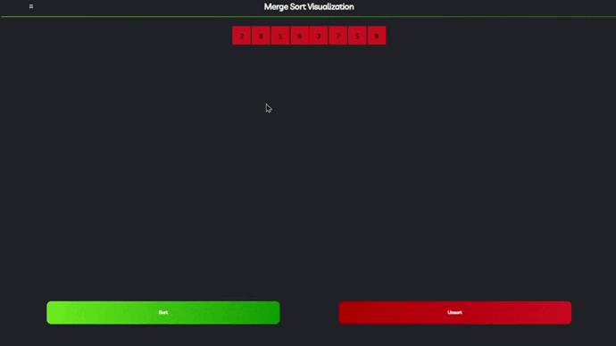

# 💻 Visualização Passo a Passo 

<div align="center">
    
    
    
</div>

## 
Aqui apresentamos a visualização passo a passo do algoritmo Merge Sort. Mostramos como o algoritmo funciona de modo a facilitar a compreensão de seu funcionamento.

## 🗂 Arquivos
- `src/index.html`: Arquivo HTML que contém a estrutura da página.
- `src/sass/`: Diretório que contém os arquivos de estilo.
- `src/js/`: Diretório que contém os arquivos JavaScript.

## 📚 Como Usar
Antes de visualizar o algoritmo, é necessário clonar o repositório. Para isso, siga os passos abaixo:
1. Abra o terminal e execute o seguinte comando:
```bash
git clone https://github.com/dudatsouza/Merge-Sort.git
```

2. Vá até o subdiretório `visualization/by_step`:
```bash
cd /visualization/by_step
```

3. Abra o arquivo `index.html` no navegador de sua preferência.

4. Para visualizar o algoritmo, clique no botão "Sort" e veja o algoritmo em ação.

5. Para reiniciar o algoritmo, clique no botão "Unsort" para redefinir a lista de números.

<p align="right"><a href="#-visualização-passo-a-passo">⬆️ Voltar para ao Início</a></p>

## 📽️ Demonstração
A seguir, apresentamos a visualização passo a passo do algoritmo Merge Sort:
1. O algoritmo inicia com a lista de números desordenada.
2. O algoritmo divide a lista em duas partes iguais.
3. O algoritmo divide uma parte em duas partes menores até conter apenas um elemento.
4. O algoritmo pega os elementos, compara e os ordena.
5. O algoritmo repete o processo para a outra parte.
6. O algoritmo mescla as partes ordenadas.

<figure align="center">
  
  <figcaption>Fonte: Autor</figcaption>
</figure>

<p align="right"><a href="#-visualização-passo-a-passo">⬆️ Voltar para ao Início</a></p>

4. **Configuração Personalizada**:
    - O usuário pode personalizar a lista de números
    - O usuário pode definir o tempo em milissegundos para a animação do algoritmo.

<figure align="center">
  
  <figcaption>Fonte: Autor</figcaption>
</figure>

<p align="right"><a href="#-visualização-passo-a-passo">⬆️ Voltar para ao Início</a></p>

## 🔧 Ambiente de Compilação
A seguir estão os detalhes do ambiente de compilação onde o programa foi executado:

| Componente      | Detalhes                          |
|-----------------|-----------------------------------|
| Sistema Operacional | Ununtu 24.04 LTS |
| Modelo do hardware| Dell Inspiron 13 5330|
| Processador     | Intel Core i7-1360P Processor (18MB Cache, up to 5.00 GHz)|
| Memória RAM     | 16GB 4800MHz LPDDR5 Memory Onboard|
| Armazenamento   | 512GB M.2 PCIe NVMe Solid State Drive|
| Placa de vídeo  | Intel(R) Iris(R) Xe Graphics |
| IDE             | Visual Studio Code 1.63.2|

> [!IMPORTANT]
> Os detalhes acima são baseados no ambiente de compilação utilizado durante o desenvolvimento do programa e podem variar em diferentes sistemas.
<p align="right"><a href="#-visualização-do-merge-sort">⬆️ Voltar para ao Início</a></p>

## 📧 Contato dos Colaboradores
Para mais informações ou sugestões, sinta-se à vontade para entrar em contato:

| Participante           |  Contato  |                     
| -----------------------| ----------|
|  Maíra Lacerda | [![Gmail][Gmail Badge]][Gmail Colab 1] [![Linkedin][Linkedin Badge]][Linkedin Colab 1] [![Instagram][Instagram Badge]][Instagram Colab 1] [![GitHub][GitHub Badge]][GitHub Colab 1]|
|  Maria Eduarda Teixeira | [![Gmail][Gmail Badge]][Gmail Colab 2] [![Linkedin][Linkedin Badge]][Linkedin Colab 2] [![Instagram][Instagram Badge]][Instagram Colab 2] [![GitHub][GitHub Badge]][GitHub Colab 2]|
|  Sergio Ramos | [![Gmail][Gmail Badge]][Gmail Colab 3] [![Linkedin][Linkedin Badge]][Linkedin Colab 3] [![Instagram][Instagram Badge]][Instagram Colab 3] [![GitHub][GitHub Badge]][GitHub Colab 3]          |  

Ficaremos felizes em receber feedbacks, contribuições ou responder a quaisquer dúvidas que você possa ter sobre o programa.
<p align="right"><a href="#-visualização-do-merge-sort">⬆️ Voltar para ao Início</a></p>

[Gmail Badge]: https://img.shields.io/badge/-Gmail-c14438?style=flat-square&logo=Gmail&logoColor=white
[Linkedin Badge]: https://img.shields.io/badge/-LinkedIn-0e76a8?style=flat-square&logo=Linkedin&logoColor=white
[Instagram Badge]: https://img.shields.io/badge/-Instagram-e4405f?style=flat-square&logo=Instagram&logoColor=white
[GitHub Badge]: https://img.shields.io/badge/-GitHub-181717?style=flat-square&logo=GitHub&logoColor=white

[Gmail Colab 1]: mailto:mairaallacerda@gmail.com
[Gmail Colab 2]: mailto:dudateixeirasouza@gmail.com
[Gmail Colab 3]: mailto:sergiohenriquequedasramos@gmail.com

[Linkedin Colab 1]: https://www.linkedin.com/in/ma%C3%ADra-almeida-lacerda
[Linkedin Colab 2]: https://www.linkedin.com/in/maria-eduarda-teixeira-souza-2a2b3a254/
[Linkedin Colab 3]: https://www.linkedin.com/in/sergio-ramos-21057230a

[Instagram Colab 1]: https://www.instagram.com/mairaallacerda/
[Instagram Colab 2]: https://www.instagram.com/dudat_18/
[Instagram Colab 3]: https://www.instagram.com/eu__sergio/

[GitHub Colab 1]: https://github.com/mairaallacerda
[GitHub Colab 2]: https://github.com/dudatsouza
[GitHub Colab 3]: https://github.com/serginnn